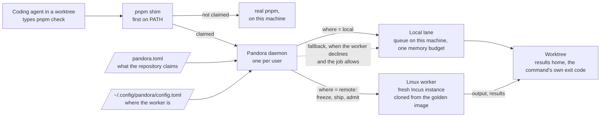

# Pandora

A coding agent finishes a change and runs the tests. Nine others on the same
machine do the same, each in its own worktree, each booting the same database,
the same browser, the same build. The machine swaps. Two runs claim the same
port and one fails. The agent reads the failure and cannot tell whether it
broke the code or a neighbor did, so it runs again. Nothing capped the load,
and nothing recorded what ran. The developer whose laptop this is can no longer
type.

Pandora is a scheduler for that machine. Agents keep typing the commands they
type today. A file at the repository root, `pandora.toml`, names the commands
Pandora claims and says where each one runs: in a fresh Linux instance on a
shared worker, or in a queue on the developer's machine with one memory budget
shared by every agent. Either way the run waits its turn in a queue
Pandora keeps, leaves a record, and its results arrive in the worktree before
the command exits with its own code. A worker run that rewrites files, such as
one that regenerates fixtures, brings them back only from a passing run over a
tree nobody edited meanwhile.

## What agents offload

Anything a developer would rather not run on the machine they are typing on:

* Static gates: type checks, lint, format and schema checks.
* Test suites, whole or one package's slice.
* End-to-end tests that boot services: a database, an API, a browser.
* Builds: bundles, native apps, container images.
* Runs that rewrite the repository: golden files, recorded responses, generated
  code.
* Device simulators and emulators.
* Migrations, seeds and benchmarks against a scratch database.
* Reproductions: run one failing test twenty times and report.
* A development server, when the repository declares its job a singleton: one
  at a time on the machine, and a second start is refused.

## Mechanism

What happens to `pnpm check` in a repository whose `pandora.toml` declares a
`check` job:

1. A `pnpm` shim sits first on PATH. It reads the worktree's claim cache with
   shell builtins. `check` is a claimed form, so the shim starts the Pandora
   client, which hands the command to the per-user daemon over a Unix socket.
   A command the file does not claim runs through the real `pnpm` with its
   arguments unchanged.
2. The daemon matches the command to the `check` job in this worktree's
   `pandora.toml`. The job declares `where = "remote"`. `PANDORA_WHERE=local`
   or `PANDORA_WHERE=remote` overrides that for one run, and exits 64 when the
   job cannot run there. The job's declared preflight, a command that
   rejects bad arguments in milliseconds, runs in the worktree before anything
   ships. A refusal exits with the validator's own code and message. A
   validator that times out is skipped.
3. For a remote job, the daemon snapshots the worktree's source, transfers it
   to the worker's content-addressed cache, and asks the worker to admit it
   against the worker's memory budget. A full worker queues the run and says
   so on stderr.
4. The worker runs the job's command in a fresh Incus system container cloned
   from the repository's golden image, which holds the toolchain and the
   installed dependencies. A local job instead waits for the daemon's memory
   budget and runs on the developer's machine. That budget limits admission.
   It is not a hard limit on each process.
5. Output streams back while the run executes. Pandora's own lines go to
   stderr with a `pandora:` prefix. The last one may be `pandora: hint: ...`,
   the next action, derived from what the run measured.
6. The declared reports and artifacts are copied into the worktree, then the
   command exits with the run's own code. An option that rewrites source, such
   as `--update`, writes its files back on the worker only after a passing run
   over a tree that still matches the snapshot. `PANDORA_WHERE=local` and
   passthrough write in place with no check.

Pandora adds five exit codes of its own. 64: a path argument below the root, a
placement the job cannot take, or an invalid `PANDORA_WHERE`. 70:
infrastructure failure, including `oom` and `timed_out`. 75: busy or stale.
124: `--max-wait` elapsed and the run continues. 130: canceled. A job's own
refusal of its arguments exits 1. A validator's refusal exits with the
validator's code.



Pandora v0.3 has been tested with one repository and one shared Linux worker,
with Macs and a teammate-key client talking to it; the e2e proves that path
against a live worker every run ([Sharing a
worker](docs/worker.md#sharing-a-worker)). Read
[Operating limits](docs/operations.md#operating-limits) before you rely on it.

## Install

On a Mac with Python 3.11 or later, the real `pnpm` on PATH, and SSH access to a
provisioned worker ([docs/worker.md](docs/worker.md)):

1. Clone the checkout and install the latest release as the version Pandora
   runs:
   `git clone https://github.com/gbasin/pandora.git ~/Code/pandora && ~/Code/pandora/bin/pandora upgrade`
   (`--from ~/Code/pandora` instead installs the checkout's HEAD.)
2. Link the launchers through `current`, first on PATH in every shell, including
   `~/.zshenv`:
   `mkdir -p ~/.local/bin && ln -s ~/.local/share/pandora/current/bin/{pandora,pnpm} ~/.local/bin/ && touch ~/.local/bin/.pandora-shim`
3. Write `~/.config/pandora/config.toml`:

   ```toml
   [worker]
   host = "ubuntu@WORKER_IP"
   engine_root = "pandora-engine"

   [client]
   state = "~/.local/state/pandora/default"
   ```

4. Start the daemon under launchd: `pandora daemon --install`
5. Enroll each repository once, from any worktree: `pandora enroll ~/Code/<repo>`
6. Prove the install from the root of an enrolled worktree: `pandora doctor`

A teammate sharing a worker installs the same way; what their key may do there
is decided server-side, by which key SSH offers
([Sharing a worker](docs/worker.md#sharing-a-worker)).

Details, failure modes and every setting: [docs/operations.md](docs/operations.md).

## For agents

Type the same commands as before, from the repository root. The exit code is the
command's own, except for these:

| Exit | Meaning |
|---|---|
| 64 | A path argument below the root, a placement the job cannot take, or an invalid `PANDORA_WHERE`. Nothing ran. |
| 1, or the validator's code | The job or its validator refused these arguments. Nothing ran. |
| 70 | Infrastructure failure, including `oom` and `timed_out`. Not a test verdict. |
| 75 | Busy or stale: another run in this worktree, a tree that changed, or a write-back conflict. |
| 124 | `--max-wait` elapsed. The run was not stopped. `pandora wait <id>` re-attaches. |
| 130 | Canceled. |

When the last stderr line is `pandora: hint: ...`, it is the next action. Act on it.

The full contract: [docs/agents.md](docs/agents.md). Paragraphs to copy into a
repository's own agent instructions: [docs/agents-paragraphs.md](docs/agents-paragraphs.md).

## Documents

* [docs/operations.md](docs/operations.md): install, upgrade, the daemon,
  enrollment and claim caches, operating limits and the source layout.
* [docs/worker.md](docs/worker.md): the worker's requirements, provisioning,
  canary, sharing and maintenance.
* [docs/pandora-toml.md](docs/pandora-toml.md): what a repository declares, and
  the fallback, queueing, write-back, retry and placement rules.
* [docs/agents.md](docs/agents.md): what agents type, with invariants, exit
  codes, variables, verbs and caller output.
* [DESIGN.md](DESIGN.md): the design rationale and the rules that make
  `pandora.toml` the contract.
* [docs/worker-rebuild.md](docs/worker-rebuild.md): the full procedure to
  rebuild a worker, with cut-over and upgrade cadence.

## Operating limits

Measured on one worker and one Mac shared with many agents. The timings, sizes
and known caveats, with their evidence notes, are in
[docs/operations.md](docs/operations.md#operating-limits).

## History

v0.1 and v0.1.1 used a per-session launcher,
`experiments/routing/launch.py`, which gave each agent session a private PATH.
v0.2 replaces it with the machine-wide shim, the daemon, per-repository
enrollment and `pandora.toml`. v0.2 ships only a `pnpm` shim. The v0.1.1
Docker profile is not carried over.

* [v0.1 contract](notes/v0.1-contract.md) and its twelve-agent baseline,
  [issue #27](https://github.com/gbasin/pandora/issues/27).
* [v0.1.1 contract](notes/v0.1.1-contract.md) and its
  [validation evidence](notes/v0.1.1-validation-2026-09-21.md),
  [issue #64](https://github.com/gbasin/pandora/issues/64).
* [DESIGN.md](DESIGN.md) holds the superseded design rationale for the
  original SSH pilot, and the current rules that make `pandora.toml` the
  contract.
